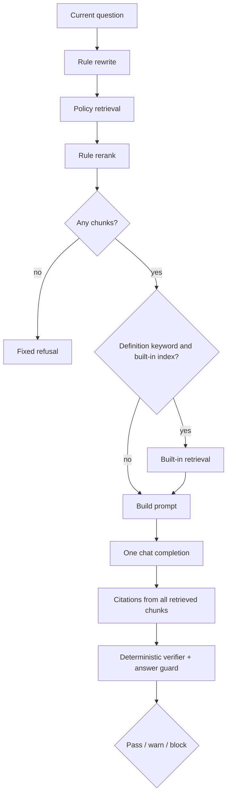
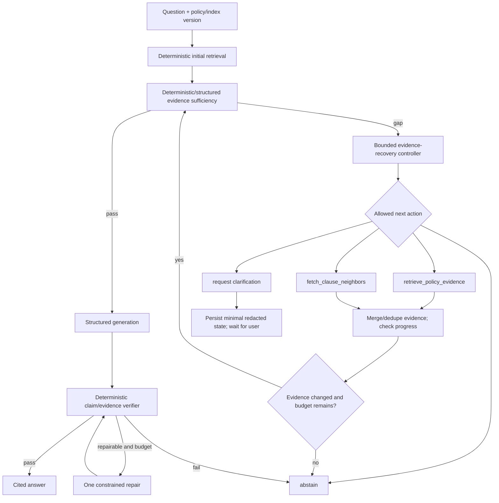

# InsuranceRAG Agentic Workflow 成熟度与 Portfolio 可信度调查

调查日期：2026-07-23

对应 Wayfinder ticket：[Assess agentic workflow maturity and portfolio credibility](https://github.com/ShiriZhang/InsuranceRAG/issues/8)

代码基线：`72989738e0a985ed4d189ca190a16d0ed3961064`

外部判据：[Agentic workflow 成熟度：第一方设计与评测指导](../research/2026-07-23-agentic-workflow-primary-source-guidance.md)

## 1. 结论摘要

InsuranceRAG 当前不是 agent，也不是 multi-agent system。它是一个由 Python 代码控制顺序的 **deterministic RAG workflow**：

```text
rewrite
→ retrieve
→ rerank
→ optional background retrieval
→ one chat completion
→ citation construction
→ deterministic verification/guard
→ render
```

当前 accurate portfolio statement 是：

> InsuranceRAG 是一个具备 hybrid retrieval、rule reranking、citation diagnostics 和 deterministic post-generation verification 的 source-grounded RAG prototype。它包含若干 agent-ready primitives，但尚未实现 model-directed tool loop、explicit resumable workflow state、bounded repair、human checkpoint 或 trace-based agent evaluation。

以下强声明没有代码证据：

- tool-using agent；
- planning agent；
- self-correcting agent；
- autonomous insurance assistant；
- multi-agent RAG；
- human-in-the-loop approval workflow；
- agent memory；
- traceable/resumable agent run。

这不是必须立即“补齐”的 feature checklist。第一方 guidance 一致建议：

- fixed、well-defined stages 保持 code orchestration；
- 只有下一步不能可靠预编码、模型需要根据 intermediate evidence 动态选择行动时，agent loop 才合理；
- 增加复杂度必须通过 evaluation 证明质量收益足以覆盖 latency、cost 和 compounded-error surface；
- multi-agent 不是成熟度目标。

InsuranceRAG 最可信的潜在 agentic seam 是：

> 在 deterministic RAG 外壳内增加一个 **single-agent、read-only、bounded evidence-recovery loop**：当 evidence sufficiency/verification 明确失败时，模型只能从少量 typed retrieval actions 中选择一次或两次补充取证；随后由 deterministic verifier 决定 answer、clarify 或 abstain。

这个方向仍只是候选能力，不是本 ticket 选定的 milestone。后续 Wayfinder ticket 应结合 glossary/ADR 和完整 audit 决定是否实施。

## 2. 调查方法

### 仓库证据

检查：

- `app.py`；
- `src/insurance_rag/rag_chain.py`；
- `query_rewriter.py`；
- retrieval/reranking、models、guard、verifier；
- requirements；
- focused tests；
- 前序 architecture、retrieval、safety、evaluation/observability 调查；
- 历史 specs/plans。

执行：

```powershell
python -m pytest -ra --durations=5 `
  tests\test_rag_chain.py `
  tests\test_query_rewriter.py `
  tests\test_models.py
```

结果：

```text
47 collected
47 passed
0 failed/skipped/xfail
3.38s
```

另用 Python AST 检查 `RagChain.answer()`：

```text
answer_loops []
chat_create_calls 1
chat_keywords [['model', 'messages', 'temperature']]
agent_runner_tool_handoff_names []
```

### Primary-source guidance

`/research` 只使用 OpenAI 与 Anthropic 第一方来源，重点包括：

- agents vs deterministic workflows；
- function tools 与 typed interfaces；
- run state / pause / resume；
- guardrails 与 human review；
- max turns、failure thresholds、stop conditions；
- tracing 和 sensitive-data controls；
- outcome + trajectory evaluation；
- multi-agent complexity threshold。

完整引用见独立 research artifact。

OpenAI Developer Docs MCP 的安装尝试因本机 `codex.exe` access denied 失败，随后按 `openai-docs` fallback 规则只使用官方 OpenAI/Anthropic 域名，没有采用二手资料。

## 3. 术语与判定标准

### Deterministic workflow

代码决定：

- 哪一步执行；
- 顺序；
- 分支条件；
- 调用哪些能力；
- 何时停止。

LLM 可以出现在其中，但不控制 workflow。

### Agentic workflow

模型根据目标、state 和 intermediate result，在受限能力集合中动态决定下一步。可靠实现还需要：

- typed tools；
- explicit state；
- bounded loop；
- stop reason；
- deterministic safety boundary；
- failure recovery；
- human escalation；
- outcome/trajectory eval；
- trace。

### Multi-agent system

多个 agent 各自拥有独立 instructions、tools/state/decision authority，并由 manager/tool call/handoff 协作。

把固定 pipeline stages 命名为 “retrieval agent”“citation agent”“critic agent” 不满足这个定义。

## 4. 成熟度 rubric

| Level | 定义 |
| --- | --- |
| A0 — LLM call | 一次模型调用或 chatbot，无 workflow control |
| A1 — code-orchestrated AI workflow | 代码控制 RAG/branch/fallback，模型生成局部输出 |
| A2 — bounded agentic seam | 模型在少量 typed tools 中动态选行动，有 explicit state、budget 和 deterministic exit |
| A3 — measured/resumable agent | 有 durable state、HITL、privacy-aware trace、trajectory eval、recovery |
| A4 — operated autonomy | 有 production monitoring、permissions、SLO、drift/incident governance |

InsuranceRAG 当前总体为 **A1**。

它比普通单次 prompt 更成熟，因为已有多个 deterministic stages、fallback、guard 和 structured diagnostics；但没有达到 A2 的 model-directed action loop。

## 5. 当前实际 workflow



关键：

- 分支条件全部由代码或规则控制；
- 模型只生成最终回答；
- 模型不能调用 retrieval、fetch、verify 或 escalation tool；
- guard 不会把 actionable feedback 返回给生成模型；
- blocked answer 不会触发 repair；
- 没有 while/for agent loop；
- 没有 run state object；
- 没有 pause/resume。

## 6. 代码状态 ledger

### 6.1 Implemented：deterministic engineering primitives

| Primitive | Evidence | Portfolio value |
| --- | --- | --- |
| Session lifecycle | Streamlit `session_state` 保存 parser、retriever、chunks、messages | 清晰的本地数据生命周期 |
| Rule query rewrite | intent triggers + deduplicated expanded queries | 可测试、低成本 |
| Hybrid retrieval | vector + BM25 + RRF | 多信号 retrieval |
| Rule reranking | title/fact/subject/numeric reasons | 可解释 ranking |
| Background gate | definition keywords 才考虑 built-in context | source-role boundary |
| Structured payload | citations、retrieval explanations、guard、verification | agent-ready state primitives |
| Deterministic verifier | facts、severity、supporting citation IDs | 强 postcondition seam |
| Safe fallbacks | retrieval/refusal、rerank fallback、built-in fallback、guard fail-closed | bounded deterministic recovery |
| Regression tests | 47 focused / 222 full baseline | 可执行证据 |

这些是可信的 AI engineering 能力，但不应被重新命名成 agents。

### 6.2 Partially implemented：agent-ready but incomplete

#### Explicit state

已有：

- `AnswerPayload`；
- `RetrievalExplanation`；
- `AnswerGuardResult`；
- `CitationVerificationResult`；
- session-scoped messages/chunks/retrievers。

缺少：

- run ID / trace ID；
- current phase；
- attempt/retry/turn budgets；
- accumulated evidence IDs；
- candidate claims；
- action history；
- no-progress signal；
- typed stop reason；
- resumable checkpoint。

因此当前是 data carriers，不是 agent workflow state。

#### Verification

已有独立 verifier/guard，是未来 repair loop 很好的 postcondition。

但：

- verifier 输出不会驱动第二次 retrieval/generation；
- unsupported claim 只会 block；
- 没有 `insufficient_evidence` 与 `contradiction` 的完整开放词汇 contract；
- 没有 agent trajectory eval。

#### Recovery

已有：

- retrieval exception → refusal；
- rerank exception → original order；
- built-in exception → policy-only；
- guard exception → blocked answer。

缺少：

- retry policy；
- alternate retrieval strategy chosen from state；
- no-progress detection；
- repair budget；
- provider timeout taxonomy；
- checkpoint/resume。

这是 deterministic fallback，不是 self-correction。

#### Human escalation

已有：

- fixed refusal；
- warnings；
- blocked answer；
- UI citation/verification details。

缺少：

- explicit `human_required` disposition；
- clarification question state；
- reviewer handoff packet；
- pause/resume；
- approval boundary。

纯 read-only policy QA 当前不需要虚构 action approval。更合适的是 clarification、abstention 和 evidence packet。

### 6.3 Placeholder / inert

- `query_rewrite_llm=True` 只增加“未启用”warning；
- `answer_guard_llm` 定义但 production 不使用；
- `verifier_enabled` / `verifier_strictness` 定义但不控制 verifier；
- `heading_confidence_warn_threshold` 没有接入 runtime。

这些 config 名称不能作为 agentic capability 证据。

### 6.4 Documentation-only

历史 plan 中的 “agentic workers” 指实现 plan 的开发代理，不是 InsuranceRAG 产品 architecture。

历史 docs 没有定义：

- product agent；
- tools；
- model-directed planning；
- agent loop；
- handoff；
- durable state。

### 6.5 Absent

- Agents SDK、LangGraph 或类似 agent runtime；
- function/tool schemas；
- model tool choice；
- agent loop/max turns；
- planner；
- handoff；
- agent memory；
- action permissions；
- HITL interrupt；
- agent trace；
- trajectory graders；
- multi-agent coordinator。

没有 agent framework 本身不是缺陷；没有必要性和 metrics 时，保持 absent 是正确选择。

## 7. 成熟度 scorecard

| Capability | Level | Evidence | Gap |
| --- | --- | --- | --- |
| Model controls workflow | A0 | 模型只生成 answer | 代码决定所有 actions |
| Planning | A0 | 无 plan/state transition | 无 objective/plan/stop model |
| Dynamic tool selection | A0 | chat call无 `tools` | retrieval 由代码直接调用 |
| Tool contracts | A0–A1 | Python protocols/functions | 无 model-facing schema/typed failures |
| Explicit workflow state | A1 | payload/session dataclasses | 无 phase/budget/stop/checkpoint |
| Verification | A1–A2 primitive | 独立 verifier/guard | 不反馈到 repair loop |
| Recovery | A1 | deterministic fallbacks | 无 retry/alternate action/no-progress |
| Human escalation | A1 | refusal/warnings | 无 clarification/checkpoint/handoff packet |
| Memory | A0 | UI 显示 history | history 不发给 model，无 run memory |
| Observability | A1 | UI diagnostics | 无 trace/span/correlation/usage |
| Agent evaluation | A0 | component regression | 无 trajectory/multi-trial agent eval |
| Multi-agent | A0 | 无 | 目前不需要 |

## 8. Primary-source guidance 如何约束设计

### 8.1 Agent 不是所有 LLM application 的默认终点

[OpenAI 的 agent 指南](https://openai.com/business/guides-and-resources/a-practical-guide-to-building-ai-agents/)把 agent 的核心放在 LLM 管理 workflow 和动态选择 tools，并明确指出不符合复杂度条件时 deterministic solution 可能足够。

[Anthropic 的工程指导](https://www.anthropic.com/engineering/building-effective-agents)区分：

- workflow：predefined code path；
- agent：model dynamically directs process/tool use。

它建议从最简单解法开始，只在 measurable outcome 改善时增加复杂度。

Inference：当前 InsuranceRAG 的固定 pipeline 适合继续由代码控制；整体迁移 agent framework 没有第一方 guidance 支持。

### 8.2 Single agent before multi-agent

OpenAI 建议 incremental orchestration：一个 agent 逐步增加 tools，只有复杂度需要时才拆 multi-agent。

InsuranceRAG：

- 一个 policy corpus；
- 一个 question；
- retrieval、claims、citations 强共享 context；
- 没有自然独立并行任务；
- 没有 specialist action systems。

Inference：manager + retrieval/generation/citation/critic agents 会增加 coordination、token、latency 和 debugging surface，不解决当前 evidence contract。

### 8.3 Tools 必须是能力与权限边界

第一方 function-calling guidance 强调清晰 schema、参数语义、返回值、错误和 strict validation。

适合未来 agent seam 的 read-only tools：

```text
retrieve_policy_evidence
fetch_clause_neighbors
retrieve_background_definition
verify_claims
```

不应暴露：

- arbitrary filesystem；
- unrestricted web search；
- raw OpenAI client；
- guard bypass；
- policy/claim mutation；
- claim submission。

### 8.4 Bounded loop 与 human intervention

OpenAI 建议为失败阈值、高风险 action 设置 human intervention，并使用 turn limits；Agents SDK 有 `MaxTurnsExceeded`、pause/resume 和 typed tool approvals。

当前 read-only QA 没有 side effects，因此 HITL 价值不是添加一个“Approve answer”按钮，而是：

- ambiguity → ask targeted clarification；
- evidence conflict/absence → abstain；
- personalized adjudication → hand control back；
- repeated verification failure → stop with evidence packet。

### 8.5 Trace 需要 privacy-first

[OpenAI Agents SDK tracing](https://openai.github.io/openai-agents-python/tracing/)可记录 generations、tools、handoffs、guardrails 和 custom spans，但官方说明 generation/tool spans 可能捕获敏感 input/output，且敏感数据捕获默认开启。

InsuranceRAG policy text 可能包含个人/医疗/财务信息。

Inference：如果未来采用 Agents SDK，不能直接接受默认 trace policy。至少需要：

- `trace_include_sensitive_data=False` 或 custom redacted processor；
- pseudonymous document/evidence IDs；
- retention/access/deletion policy；
- 不记录 raw PDF/full prompt/full answer。

### 8.6 Agent eval 必须看 outcome 和 trajectory

[Anthropic 的 agent eval 指导](https://www.anthropic.com/engineering/demystifying-evals-for-ai-agents)强调 agent 会多 turn、调用 tools、修改 state，错误会累积；应记录 trials、graders 和完整 trajectory，并区分 capability 与 regression eval。

因此 portfolio demo 不能只展示最终答案。还要评分：

- selected tool 是否合适；
- query rewrite 是否带来新 evidence；
- evidence set 是否进展；
- turns 是否必要；
- stop reason 是否正确；
- verifier/guard 是否被尊重；
- latency/token/cost。

## 9. 哪些路径应该保持 deterministic

| Workflow | Recommendation | Reason |
| --- | --- | --- |
| PDF validation/size bounds | deterministic | 明确安全与资源规则 |
| Parse/OCR fallback | deterministic | 可预测、可测试，无模型决策价值 |
| Chunking/metadata | deterministic | 可重复 index contract |
| Embedding/index build | deterministic | provider operation，不需要 agent |
| Initial hybrid retrieval | deterministic | 低 latency baseline |
| RRF/rule rerank | deterministic | 已有解释和 regression tests |
| Citation ID/formatting | deterministic | provenance contract |
| Claim schema validation | deterministic | 不能交给自由文本 |
| Verifier/guard final gate | deterministic | safety postcondition |
| Retry/backoff for transient provider errors | deterministic | typed error policy更可靠 |
| Privacy/redaction | deterministic | 不能由模型自行选择 |
| Metrics/trace emission | deterministic | audit record必须完整 |
| Final claim/legal/medical decisions | do not automate | 产品 out of scope、高风险 |

把这些阶段变成 named agents 会降低一致性，并使问题更难定位。

## 10. 哪些路径可能真正受益于 agentic behavior

### 10.1 Bounded evidence recovery — strongest fit

触发条件：

- initial retrieval 有结果，但 evidence sufficiency 不通过；
- verifier 能指出 missing/unsupported claim 或 required fact type；
-存在多个合理 retrieval action，最佳下一步依赖 intermediate evidence。

模型可以选择：

```text
rewrite_query with a missing fact/subject/condition
search exact policy term
fetch neighboring/reference clause
request one clarification
abstain
```

为什么可能适合 agent：

- required substep 不能总在 query 前预测；
- policy language 非结构化；
- intermediate evidence 决定下一 action；
- read-only tool surface 可严格限制；
-有 objective verifier feedback。

为什么必须 bounded：

- 一份 policy、一个问题，不需要开放式 research；
- extra turns 会增加 cost/latency；
-重复 retrieval 可能没有新信息；
-错误 query 会放大 source confusion。

### 10.2 Clause reference navigation — plausible fit

保单可能出现：

- “见第 X 条”；
-定义引用；
-责任与除外跨 section；
-主体/期限分散。

如果 gold corpus 证明 single-pass chunk retrieval 经常漏掉 referenced clause，可以允许模型调用：

```text
fetch_clause_by_reference
fetch_neighboring_clause
```

这比 unrestricted agent search 更窄、更可解释。

### 10.3 Clarification/resume — workflow/HITL fit

适合：

- “等待期是多少”但文档包含多个产品/责任等待期；
- question 缺少所指责任/主体；
-用户请求个案理赔判断；
-上传文档版本不明确。

系统应该显式进入：

```text
needs_clarification
→ ask one evidence-driven question
→ save state
→ user response
→ resume retrieval
```

这是有价值的 stateful/HITL capability，但不必用 multi-agent。

### 10.4 Developer-side failure analysis — separate possible agent

在 CI/evaluation artifact 上：

```text
detect regression
→ inspect failed cases/traces
→ group failure modes
→ recommend experiment
```

它可能适合开发者 agent，因为输入是无私人内容的 structured artifacts，且结果由 human reviewer 决定。

但这不是 policy QA user workflow，不应混进用户-facing runtime。

## 11. 不适合 agentic 化的候选

### Autonomous claim adjudication

拒绝：

- 超出产品 scope；
- 高风险；
- evidence 不足；
-可能被误解为 insurer/legal decision。

### Default web research

拒绝：

- 破坏 user-policy-primary source boundary；
-新鲜网页信息不能证明保单事实；
- prompt injection surface 扩大；
- source attribution 更复杂。

单独、明确的 background research 产品可以另行设计，但不能作为默认 QA fallback。

### Multi-agent review panel

例如：

```text
retrieval agent
generation agent
citation agent
safety critic agent
manager agent
```

拒绝：

- stages 高度共享同一 evidence；
-无并行独立 subproblem；
- deterministic verifier 已是更强 safety boundary；
-没有 gold metrics 证明 critic 提升；
-增加 token、latency 和 failure modes。

### Unlimited reflection/self-critique

拒绝：

-无 independent ground truth；
-无 objective progress；
-可能重复确认同一错误；
-成本/延迟无上限。

### Long-term personal memory

当前不适合：

-无明确用户价值；
-增加 policy/health/financial privacy risk；
-不解决 evidence sufficiency；
-当前产品承诺 session-only。

### Framework migration as milestone

把 Chat Completions 换成 Agents SDK/LangGraph 不能单独构成 portfolio capability。

framework 只应在明确需要以下能力时选择：

- model tool loop；
- resumable state；
- HITL interrupts；
- tracing；
- durable execution。

## 12. 推荐的 hybrid architecture



### Control allocation

模型可以决定：

- 当前 evidence gap 的语义类别；
-允许列表中的下一 read-only retrieval action；
-针对 gap 的 query；
-是否需要 clarification。

代码必须决定：

- tool schema 和 permissions；
- document/policy scope；
- maximum attempts；
- timeout/retry/cost bounds；
- evidence deduplication；
- no-progress；
- verifier/guard；
- privacy/redaction；
-最终 stop/disposition；
- trace completeness。

这体现 Agentic AI Developer 的核心判断：给模型恰好需要的决策权，不把可靠的控制面也交给模型。

## 13. 最小 explicit state

```text
run_id
policy_id / policy_hash
index_version
question
normalized_intent
phase
attempt_count
max_attempts
latency/token/cost budget
retrieval_actions[]
candidate_evidence_ids[]
selected_evidence_ids[]
evidence_gap
candidate_claims[]
claim_evidence_links[]
verification_result
guard_result
pending_clarification
stop_reason
warnings/errors
trace metadata
```

建议 stop reasons：

```text
sufficient_evidence
answered
needs_clarification
no_evidence
no_progress
verification_failed
guard_blocked
budget_exhausted
provider_unavailable
human_required
```

不得用自然语言 scratchpad 替代这些字段。

## 14. Tool contract 建议

### `retrieve_policy_evidence`

Input：

```text
policy_id
query
strategy: hybrid | lexical | exact_clause
top_k
required_fact_type?
```

Output：

```text
evidence items with stable chunk/span IDs
source/page/section
scores/reasons
index_version
typed warnings
```

### `fetch_clause_neighbors`

Input：

```text
policy_id
anchor_evidence_id
direction/radius
```

Output 只能来自同一 policy/index version。

### `verify_claims`

Input：

```text
structured claims
selected evidence IDs/spans
source roles
```

Output：

```text
supported / unsupported / contradictory / insufficient
supporting span IDs
severity
actionable gap
```

### `request_clarification`

这不是 side-effecting external tool，而是明确的 workflow disposition：

```text
question
reason
required_field
state_version
```

所有 tool implementation 应 deterministic、独立测试，并返回 typed errors。

## 15. Bounded autonomy contract

至少包括：

- retrieval actions 上限；
- generation repair 上限；
- provider retry 上限；
- total turns；
- wall-clock timeout；
- token/cost budget；
- evidence unchanged → stop；
- repeated action signature → stop；
-任何 out-of-policy scope tool call → reject；
- verifier/guard 不可由 agent override；
-预算耗尽 → deterministic abstention；
-所有 transitions 写 trace。

这比“请仔细反思并重试”更可信。

## 16. Portfolio demonstrations

### Demo 1：Evidence-gap recovery — 推荐

#### Scenario

使用 versioned public policy fixture。问题的答案需要主条款和被引用的限制/定义；single-pass baseline 只召回主条款。

#### Demonstration

1. deterministic initial retrieval；
2. evidence sufficiency 标出缺少 condition/reference；
3. single agent 选择 `fetch_clause_neighbors` 或 targeted rewrite；
4.新 evidence 进入 state；
5. structured answer claims；
6. deterministic verifier；
7. cited answer 或 abstain；
8.完整 redacted trace。

#### Measurable evidence

- 对比相同 fixture 的 deterministic baseline；
- evidence recall/sufficiency；
- required-claim recall；
- unsupported-claim rate；
- citation attribution；
- repair success；
- unnecessary action rate；
- turns/latency/tokens/cost；
- stop-reason correctness。

#### Why credible

它展示：

- agent necessity；
- typed read-only tools；
- state transitions；
- bounded recovery；
- deterministic safety；
- evaluation；
- observability。

### Demo 2：Ambiguity → clarification → resume

#### Scenario

一个保单中有多个等待期、豁免主体或责任范围，原问题无法唯一回答。

#### Demonstration

```text
detect ambiguity
→ `needs_clarification`
→ persist state
→ ask one targeted question
→ user selects scope
→ resume
→ answer with matching evidence
```

#### Metrics

- ambiguity detection precision/recall；
- unnecessary clarification rate；
- post-clarification answer correctness；
- state resume correctness；
- no cross-policy/source leakage。

### Demo 3：Failure injection and deterministic recovery — supporting demo

Inject：

- embedding timeout；
- retrieval empty；
- reranker exception；
- provider rate limit；
- verifier runtime failure；
- budget exhaustion。

Show：

- typed failure；
- retry/fallback boundary；
- no duplicate action；
- final abstention；
- trace and metric。

这是强 Agentic AI engineering evidence，但大部分 recovery 应保持 deterministic。它是 Demo 1 的可靠性支撑，不是另一个 agent。

## 17. Evaluation design

### Baselines

同一 public corpus、questions、config：

1. current single-pass deterministic RAG；
2. bounded evidence-recovery workflow。

### Outcome graders

- relevant evidence recall；
- answer correctness/completeness；
- claim support；
- citation precision/recall；
- source-role accuracy；
- correct abstention/clarification；
- safety outcomes。

### Trajectory graders

- allowed tool only；
- correct tool choice；
- valid parameters；
- new evidence/progress；
- duplicate/redundant actions；
- transition validity；
- attempts/budget；
- correct stop reason；
- verifier/guard respected；
- no sensitive content in trace。

### Operations

- success per trial；
- multiple trials for model nondeterminism；
- p50/p95 latency；
- tokens/cost；
- provider/tool errors；
- retry/fallback rate。

### Decision rule

只有当 agentic variant：

- 对同一 gold set 有明确 outcome gain；
-没有增加 unsupported/safety failures；
- trajectory 合规；
- latency/cost 在定义预算内；

才应保留。

否则退回 deterministic workflow 是成功的工程判断，不是 portfolio 失败。

## 18. Human escalation boundary

### 自动 clarification

允许系统询问：

- 你指哪个责任/产品/主体？
- 是否还有引用页或完整条款？
- 你要的是术语解释还是个案理赔判断？

### 必须 abstain / hand back

- personalized claim outcome；
-法律、医疗、财务 advice；
-矛盾 policy versions；
-关键 evidence 缺失；
- verifier/guard failure；
- budget exhausted；
- provider failure after bounded retry。

### Reviewer packet

如果未来有人工 reviewer，handoff 应包含：

```text
user question
scope/policy version
selected evidence IDs and excerpts
unresolved evidence gap
verification failures
attempts/actions
stop reason
no model private reasoning
```

当前没有外部 action tools，因此不需要 approval theater。

## 19. Observability 与 privacy

每次 run 应能重建：

```text
state transition
tool call
tool result summary
evidence delta
verification result
guard outcome
stop reason
duration/usage/cost
```

默认不记录：

- raw PDF；
- full policy text；
- full prompt；
- full answer；
- API key；
-真实文件路径。

使用：

- pseudonymous document ID；
- stable evidence/span IDs；
- redacted claim summaries；
- typed errors；
- config/model/version fingerprint。

如果采用第三方/SDK trace，必须先验证：

- sensitive capture default；
- export destination；
- retention；
- access；
- deletion；
- ZDR compatibility。

## 20. Portfolio narrative

### 现在可以准确展示

- modular deterministic RAG；
- structured retrieval diagnostics；
- hybrid retrieval + rule reranking；
- policy/background source separation；
- programmatic claim verification；
- fail-closed guard；
- deterministic regression suite；
- evidence-backed audit discipline。

### 现在不能声明

- autonomous agent；
- model-selected tools；
- self-healing workflow；
- HITL agent；
- trace-based agent eval；
- multi-agent collaboration。

### 实施 bounded seam 后才可声明

> A single-agent evidence-recovery workflow operates inside a deterministic safety shell. It dynamically selects from typed read-only retrieval tools, records explicit state and stop reasons, is bounded by turns/cost/no-progress rules, defers or abstains when evidence remains insufficient, and is evaluated against the same gold corpus and deterministic baseline using outcome and trajectory metrics.

这是 portfolio-quality claim，因为每一部分都有可执行证据。

## 21. Risk register

| Risk | Why it matters | Required control |
| --- | --- | --- |
| Agent unnecessary | complexity without outcome gain | baseline A/B eval |
| Retrieval loop amplifies wrong evidence | source confusion | policy scope + stable evidence IDs + verifier |
| Infinite/redundant loop | cost/latency | max actions + no-progress |
| Guard bypass | unsafe answer | deterministic non-overridable gate |
| Prompt injection in policy | malicious tool choice | untrusted-data isolation + tool allowlist |
| Sensitive traces | policy/customer data exposure | no-content default + retention/access policy |
| Framework opacity | hard debugging | visible prompts/state/tool contracts |
| Multi-agent context divergence | inconsistent evidence | single answer owner; avoid multi-agent |
| LLM judge self-confirmation | false confidence | code/human-calibrated graders |
| HITL theater | pointless approval friction | escalate only ambiguity/high risk/side effects |

## 22. 对后续 Wayfinder tickets 的输入

### Glossary candidates

- deterministic workflow；
- agentic workflow；
- agent loop；
- tool；
- explicit state；
- evidence gap；
- evidence sufficiency；
- action budget；
- no-progress；
- stop reason / disposition；
- clarification；
- abstention；
- human escalation；
- outcome grader；
- trajectory grader；
- agent run / trace。

### ADR candidates

1. deterministic shell + bounded evidence-recovery seam；
2. single-agent vs multi-agent boundary；
3. tool schema、policy scope 和 permissions；
4. explicit state/stop-reason schema；
5. deterministic verifier/guard authority；
6. agent loop budgets/no-progress；
7. trace privacy and retention；
8. outcome + trajectory evaluation gate；
9. framework choice only after capability boundary is agreed。

### Milestone candidates

本 ticket 不选择 milestone，但 evidence 支持比较：

- public gold corpus + claim/evidence contract；
- production-equivalent trace/eval spine；
- bounded evidence-recovery tracer bullet；
- clarification/resume state。

顺序上，agentic loop 依赖 gold data、evidence contract 和 trace；否则无法证明它优于 baseline。

## 23. 可复核命令

```powershell
# focused orchestration baseline
python -m pytest -ra --durations=5 `
  tests\test_rag_chain.py `
  tests\test_query_rewriter.py `
  tests\test_models.py

# agent/workflow vocabulary and dependencies
rg -n -i "agent|planner|tool.?call|handoff|checkpoint|retry|loop|trace|repair" `
  app.py src scripts tests README.md

Get-Content requirements.txt

# current orchestration
rg -n "def answer|rewrite_query|search\\(|rerank_results|chat.completions.create|check_answer" `
  src\insurance_rag\rag_chain.py

# session state and history
rg -n "session_state|messages|RagChain|chain.answer" app.py

# AST structure
python -c "import ast,pathlib; p=pathlib.Path('src/insurance_rag/rag_chain.py'); t=ast.parse(p.read_text(encoding='utf-8')); c=next(n for n in ast.walk(t) if isinstance(n,ast.ClassDef) and n.name=='RagChain'); a=next(n for n in c.body if isinstance(n,ast.FunctionDef) and n.name=='answer'); print([type(n).__name__ for n in ast.walk(a) if isinstance(n,(ast.For,ast.While,ast.AsyncFor))])"
```

## 24. 最终判断

InsuranceRAG 当前的 agentic maturity 是 A1：有扎实的 deterministic AI workflow 和若干高价值 agent-ready primitives，但没有 agent loop。

正确的发展方向不是把现有 modules 重新包装成 personas，而是：

1. 先建立 gold cases、evidence sufficiency 和 claim/evidence contract；
2. 保持 ingestion、initial retrieval、verification、safety 和 privacy deterministic；
3. 只在 evidence-gap recovery 这个窄 seam 给予模型有限 action selection；
4.显式记录 state、budgets、evidence delta 和 stop reason；
5. 用 outcome + trajectory eval 与 current baseline 对比；
6. 若无 measurable gain，删除 agentic loop。

这种“可以证明何时该用 agent、也可以证明何时不该用”的判断，本身比展示更多 agent 名称更能体现成熟的 Agentic AI Developer 能力。
