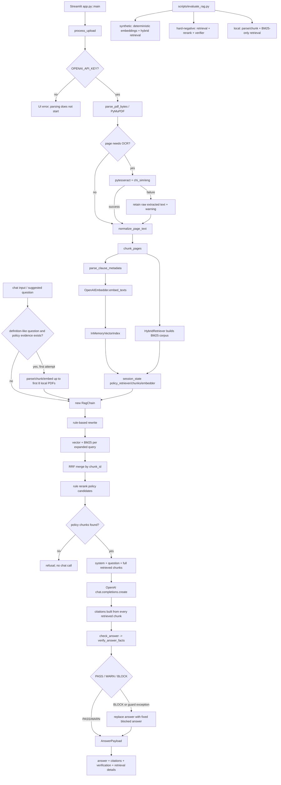

# InsuranceRAG 端到端架构与代码状态调查

日期：2026-07-23  
对应 Wayfinder 调查：[Reconstruct the actual end-to-end InsuranceRAG architecture and code-state ledger](https://github.com/ShiriZhang/InsuranceRAG/issues/2)

## 调查范围与证据标准

本调查只回答“当前代码实际有哪些可执行路径，以及各组件处于什么状态”。不评判下一阶段优先级，不实现修复，也不把历史设计文档当成已交付能力。

证据优先级：

1. 入口函数与实际调用关系；
2. 当前工作区执行的测试、CLI 和小型运行时探针；
3. 测试中明确覆盖的分支；
4. README、spec 和 plan 仅用于识别“文档声称但代码未实现”的内容。

本次没有调用真实 OpenAI API，也没有读取或提交 `documents/` 中的本地保单内容。因此，在线生成路径被证明为“代码可达且由 fake/mock 测试覆盖”，不是“真实外部服务端到端已验证”。

## 结论摘要

- 当前系统有两个真实入口：
  - 在线 Streamlit 入口：`app.py:243-314`；
  - 离线评估入口：`scripts/evaluate_rag.py:26-162`。
- 在线主路径已经串联 PDF ingestion、OCR fallback、chunking、条款元数据、OpenAI embeddings、内存向量索引、BM25/RRF hybrid retrieval、规则 reranking、OpenAI chat generation、检索片段 citations、事实级 verification、answer guard 和 Streamlit 输出。
- 在线路径不是 agentic workflow；它是一次固定顺序、无工具循环、无显式计划/状态机的 deterministic RAG pipeline。
- 离线评估不是在线路径的完整镜像：
  - synthetic eval 只覆盖 rewrite + hybrid retrieval；
  - hard-negative eval 增加 rule reranker 和 citation verifier；
  - local-document eval 实际使用 BM25-only embedder 和零向量，不覆盖在线 OpenAI vector retrieval；
  - 三者都不执行 chat generation，且不经过完整 `RagChain.answer()` + `check_answer()` 输出流程。
- 多个配置项和类型已定义、可由环境变量设置、也有配置测试，但没有接入运行时：`answer_guard_llm`、`verifier_enabled`、`verifier_strictness`、`heading_confidence_warn_threshold`；`query_rewrite_llm` 虽被传入，但只触发“未启用”warning。
- `infer_section_title()` 和 `RerankExplanation` 是兼容/遗留表面，不在生产执行路径中；尚不能仅凭仓库内部引用证明它们可安全删除。
- 2026-07-09 retrieval baseline comparison 只存在于未跟踪的 spec/plan 中；计划中的 `compare_document_chunks`、`RetrievalComparisonReport` 和 `scripts/compare_retrieval_modes.py` 当前均不存在。
- 当前 checkout 在系统 Python 环境中通过 222 个测试，synthetic eval 为 2/2，hard-negative eval 为 4/4；仓库 `.venv` 缺少 `rank_bm25`，导致完整测试 collection 和两个评估 CLI 在 import 阶段失败。这一环境事实不改变代码结构判断，但说明“仓库附带虚拟环境”当前不能作为可运行证明。

## 实际执行架构



## 在线路径逐段重建

### 1. 入口、会话状态和上传

- `app.py` 在 import 时把 `src/` 加入 `sys.path`，并设置 Streamlit page config（`app.py:6-24`）。
- `main()` 初始化 session state、从环境变量构造 `AppConfig`、渲染上传器和聊天 UI（`app.py:243-288`）。
- 上传按钮调用 `process_upload()`（`app.py:250-254`）。
- `process_upload()` 首先清空上一份保单、索引、消息和内置资料状态（`app.py:37-44,186-187`）。
- UI 在解析 PDF 之前强制要求 `OPENAI_API_KEY`（`app.py:189-191`）。因此，虽然 PDF parser 本身不依赖 OpenAI，在线 UI 不能在无 key 时只做本地解析。

状态：**implemented**。

### 2. PDF ingestion 与 OCR fallback

- `parse_pdf_bytes()` 使用 PyMuPDF 从内存 bytes 打开 PDF，逐页调用 `page.get_text("text")`（`src/insurance_rag/document_loader.py:63-76`）。
- 页面文本过短或乱码比例超过阈值时触发 OCR（`document_loader.py:17-28,77-80`）。
- OCR 把页面渲染为 2x bitmap，调用 `pytesseract.image_to_string(..., lang="chi_sim+eng")`（`document_loader.py:51-60`）。
- OCR import、runtime 或语言包失败时保留原始文本，并对相同 failure key 去重 warning（`document_loader.py:81-88`）。
- 页面规范化保留换行，用于后续 heading 检测；OCR/空页信息进入 `quality_notes`（`document_loader.py:31-48`）。

状态：**implemented with external-runtime dependency**。OCR 算法和 fallback 已实现；是否能识别扫描版中文取决于仓库外的 Tesseract runtime 与语言包，失败后仍可能得到不可用的短文本。

可执行证据：`tests/test_document_loader.py:52` 验证内存 PDF 文本提取；`tests/test_document_loader.py:69` 验证 OCR runtime 失败时保留文本页。

### 3. Chunking 与条款元数据

- `chunk_pages()` 逐页切分 paragraph/chunk，跨 chunk 和跨 page 传递当前 section title（`src/insurance_rag/chunker.py:67-99`）。
- `_split_text()` 检查 `chunk_size/overlap`，按换行聚合并对超长段落做字符窗口 overlap（`chunker.py:42-64`）。
- 每个 chunk 调用 `parse_clause_metadata()`；条款解析器跳过目录样式行，识别编号标题或已知标题，否则回退到上一标题并标记 low confidence（`src/insurance_rag/clause_parser.py:46-74,77-157`）。
- `DocumentChunk` 保存 page、source type、section、OCR notes、clause id、heading source/confidence（`src/insurance_rag/models.py:22-35`）。

状态：**implemented**。

可执行证据：本次探针把“第十条 等待期”页面转换为 1 个 `等待期` chunk；相关 chunker/clause parser 测试包含在通过的 152 个无-BM25测试中。

### 4. Embedding、向量索引与 hybrid retrieval

- `OpenAIEmbedder` 批量调用 OpenAI embeddings API（`src/insurance_rag/retriever.py:15-22`）。
- `build_index()` 一次性为全部 chunk 生成 embeddings；`InMemoryVectorIndex` 归一化矩阵并使用 cosine/dot-product 排序（`retriever.py:25-72`）。
- `HybridRetriever` 初始化时为同一批 chunk 构建 BM25 token corpus；tokenization 同时加入保险术语、ASCII token、CJK 单字和 bigram（`src/insurance_rag/hybrid_retriever.py:14-52,130-154`）。
- 查询的每个 expansion 都会生成 embedding；vector 与 BM25 排名通过 RRF 累加到 `chunk_id`（`hybrid_retriever.py:156-197,199-285`）。
- `retrieval_mode="vector"` 时不执行 BM25；hybrid 模式下 vector 的 `ValueError` 可降级到 BM25，BM25 建立/查询错误会被静默跳过（`hybrid_retriever.py:151-154,175-188,224-251`）。
- 上传索引和可选 built-in 索引都使用相同 `OpenAIEmbedder`、`InMemoryVectorIndex`、`HybridRetriever` 组合（`app.py:52-87,216-238`）。

状态：**implemented**。

可执行证据：`tests/test_hybrid_retriever.py:69` 验证 BM25 补回精确术语；`tests/test_hybrid_retriever.py:285` 验证 vector 失败时继续 BM25。完整 hybrid 路径在系统 Python 的 222 个通过测试中执行。

### 5. Built-in background path

- 本地 `documents/` 被递归发现并按路径排序；company/product 仅由相对路径前两段推断（`src/insurance_rag/builtin_dataset.py:16-26`）。
- `select_background_pdfs()` 不是检索或分类，只取排序后的前 8 份（`builtin_dataset.py:29-33`）。
- 只有问题包含“什么是/定义”等词且已有 policy results 时才使用 built-in context（`src/insurance_rag/rag_chain.py:21-25`）。
- app 在每个上传会话中至多尝试建立一次 built-in index；单个 PDF 解析异常被吞掉，整体索引失败降级为 policy-only（`app.py:52-101`）。
- `RagChain.answer()` 再次检查 built-in gate，built-in retrieval 失败时保留 policy-only answer（`rag_chain.py:133-143`）。

状态：**partially implemented**。数据路径与隔离规则存在，但“背景资料选择”只是固定前 8 份，不是与问题相关的选择；第一次建立失败后本会话不重试。

### 6. Query rewrite、RRF 和 reranking

- `rewrite_query()` 用硬编码 trigger 扩展等待期、免责、保障、豁免、定义等查询，并输出 detected intents（`src/insurance_rag/query_rewriter.py:8-75`）。
- `RagChain` 将 `query_rewrite_llm` 传入 rewrite（`rag_chain.py:96-99`），但 `use_llm=True` 只加入“LLM 未启用”warning；返回值始终 `used_llm=False`（`query_rewriter.py:42-74`）。
- policy retrieval 在 rerank 开启时先取 `max(policy_top_k, rerank_top_n)`，再按标题意图、事实类型、精确术语、主体、数字、heading confidence 和目录样式进行规则调整（`rag_chain.py:101-128`; `src/insurance_rag/rule_reranker.py:47-168`）。
- reranker 只应用于 policy results；built-in results 不 rerank（`rag_chain.py:116-141`）。
- rerank 抛错时退回原始检索排序；policy search 抛错时直接 refusal（`rag_chain.py:106-131`）。

状态：

- rule rewrite：**implemented**；
- LLM rewrite：**placeholder**；
- policy rule reranking：**implemented**；
- built-in reranking：**not integrated**，当前设计直接使用 hybrid 排名。

可执行证据：`tests/test_rag_chain.py:214` 验证 rerank 在 prompt 前执行；`tests/test_rag_chain.py:252` 验证 rerank failure fallback。

### 7. Generation、citation、verification 与 guard

- 至少一个 policy chunk 存在时，prompt 包含 system rules、用户问题、所有选中 policy chunk 全文和可选 built-in chunk 全文（`rag_chain.py:42-71,129-150`）。
- chat generation 使用配置的 model 和固定 `temperature=0.2`（`rag_chain.py:145-151`）。
- Citation 不是 model 生成的 inline citation。代码对每个已检索 chunk 构造一个最多 180 字的 excerpt，并把所有 policy/built-in results 都作为 citations 返回（`rag_chain.py:28-39,151-156`）。
- `check_answer()` 先阻断最终理赔判断，再调用 `verify_answer_facts()` 检查数字、文本事实和 source confusion；随后执行额外的 policy-fact 支持、低分、少引用和 OCR warning 规则（`src/insurance_rag/answer_guard.py:90-177`）。
- verifier 使用 regex/词典从 answer 中提取事实，并在 citation excerpt 中查找同一条款/数值或文本支持（`src/insurance_rag/citation_verifier.py:96-200`）。
- guard block 会用固定 blocked answer 替换生成结果；guard 自身异常也 fail closed（`rag_chain.py:157-177`）。

状态：

- chat generation：**implemented, external API dependent**；
- retrieved-chunk citation：**implemented**；
- claim-to-evidence verification：**implemented as deterministic heuristics, not semantic entailment**；
- safety guard：**implemented as layered prompt + regex/lexicon checks**；
- model-produced citation alignment：**not implemented**。当前 citations 证明“这些 chunk 被送入 prompt”，不证明答案中的每个 claim 实际由对应 chunk 支持。

可执行证据：

- `tests/test_rag_chain.py:155` 覆盖 policy-first、built-in citation 和 fake chat happy path；
- `tests/test_rag_chain.py:174` 覆盖无 policy evidence 时不调用 chat；
- `tests/test_rag_chain.py:198` 覆盖 built-in retrieval failure 降级；
- `tests/test_rag_chain.py:394` 覆盖 guard block 替换答案；
- `tests/test_rag_chain.py:424` 覆盖 verification 进入 payload；
- `tests/test_rag_chain.py:436` 覆盖 guard runtime failure 时 fail closed。

### 8. Streamlit 输出与会话生命周期

- UI 渲染 answer、policy/built-in citations、fact verification 和 retrieval/rerank explanations（`app.py:104-183,294-310`）。
- 上传内容、chunks、retrievers、embedder 和 chat messages 都保存在 Streamlit session state；仓库代码没有持久化这些对象（`app.py:27-44,233-239`）。
- 最外层问题处理捕获任意异常，返回通用错误 answer 并把 `str(exc)` 放入 warnings（`app.py:294-307`）。

状态：**implemented**。会话内生命周期由代码明确；没有数据库、外部 vector store、后台 job 或持久化 chat history。

## 离线评估路径

### Synthetic retrieval

`evaluate_synthetic_cases()` 使用 deterministic hash embedder、`InMemoryVectorIndex`、`HybridRetriever` 和 rule rewrite，检查 expected section/terms rank（`src/insurance_rag/evaluation.py:156-212`）。

状态：**implemented but retrieval-only**。它不调用 reranker、chat generation、`check_answer()` 或 Streamlit。

### Synthetic hard negatives

`evaluate_hard_negative_cases()` 在 hybrid retrieval 后调用 rule reranker，并对 case 中预写的 answer 调用 `verify_answer_facts()`（`evaluation.py:215-275`）。

状态：**implemented but component-composition eval**。它没有通过 `RagChain.answer()` 生成答案，也没有执行完整 answer guard。

### Local documents

Local eval 复用真实 `parse_pdf_bytes()` 和 `chunk_pages()`，但使用 `Bm25OnlyEvalEmbedder`、全零向量和 hybrid mode；实际检索信号来自 BM25（`evaluation.py:393-477`）。

状态：**implemented but not an online retrieval mirror**。它适合验证真实 PDF parsing/chunking 和 BM25 term recall，不验证 OpenAI embeddings、在线 vector/hybrid 排名、reranker、generation 或 guard。

### CLI

`scripts/evaluate_rag.py` 选择 synthetic、hard-negative、local 或 local-hard-negative，生成 Markdown 到配置的 report dir，并根据 case pass 状态返回 exit code（`scripts/evaluate_rag.py:26-158`）。

状态：**implemented**。

## 代码状态 ledger

| 组件/能力 | 状态 | 生产可达性 | 证据与说明 |
| --- | --- | --- | --- |
| Streamlit upload/chat UI | implemented | 在线入口直接可达 | `app.py:243-314` |
| PyMuPDF text extraction | implemented | upload 和 local eval 可达 | `document_loader.py:63-99` |
| Tesseract OCR | partial/external | 条件可达 | `document_loader.py:24-28,51-88`；依赖仓库外 runtime |
| Chunking + clause metadata | implemented | upload、built-in、local eval 可达 | `chunker.py:67-99`; `clause_parser.py:46-74` |
| OpenAI embeddings | implemented/external | 在线 policy/built-in indexing 可达 | `retriever.py:15-22`; `app.py:216-226` |
| In-memory vector index | implemented | 在线与 eval 可达 | `retriever.py:25-72` |
| BM25 + RRF hybrid retrieval | implemented | 在线与 eval 可达 | `hybrid_retriever.py:130-285` |
| Vector-only mode | implemented | config 可达 | `config.py:52-53`; `hybrid_retriever.py:166-188` |
| Rule query rewrite | implemented | 每次在线 answer 可达 | `rag_chain.py:96-99`; `query_rewriter.py:42-75` |
| LLM query rewrite | placeholder | flag 可达、LLM path 不存在 | `query_rewriter.py:46-47,57,73` |
| Policy rule reranker | implemented | 默认在线可达 | `rag_chain.py:101-128`; `rule_reranker.py:47-168` |
| Built-in dataset indexing | partial | definition-like question时 lazy 可达 | `app.py:52-101`; 固定前 8 份 |
| Built-in reranking | unused/not integrated | 无生产调用 | built-in search 后直接取 chunks：`rag_chain.py:135-141` |
| Chat generation | implemented/external | 有 policy evidence 时可达 | `rag_chain.py:145-151` |
| Retrieved-chunk citations | implemented | generation 后可达 | `rag_chain.py:28-39,152-156` |
| Fact citation verifier | implemented heuristic | guard 内始终可达 | `answer_guard.py:104-118`; `citation_verifier.py:96-200` |
| Answer guard | implemented heuristic | generation 后可达 | `answer_guard.py:90-177` |
| `query_rewrite_llm` config | partial/placeholder | 传入 rewrite，但无 LLM | `config.py:26,54`; `rag_chain.py:98` |
| `answer_guard_llm` config | unused/inert | 无运行时读取 | `config.py:27,55`；仅 config tests/docs 引用 |
| `verifier_enabled` config | unused/inert | 无运行时读取 | `config.py:31,59`；verifier 实际始终由 guard 调用 |
| `verifier_strictness` config | unused/inert | 无运行时读取 | `config.py:32,60` |
| `heading_confidence_warn_threshold` config | unused/inert | 无运行时读取 | `config.py:33,61-63` |
| `hard_negative_local_limit` config | implemented | CLI local-hard-negative 可达 | `config.py:34,64-66`; `scripts/evaluate_rag.py:106-109` |
| `infer_section_title()` | unused compatibility surface | production 不调用，tests 直接调用 | `chunker.py:32-39`; `chunk_pages()` 已改用 clause parser |
| `RerankExplanation` | unused data type | production 不构造 | `models.py:83-87`；仅 model test/docs 引用 |
| Synthetic eval | implemented, partial system coverage | CLI 可达 | `evaluation.py:156-212` |
| Hard-negative eval | implemented, partial system coverage | CLI 可达 | `evaluation.py:215-275` |
| Local document eval | implemented BM25-only | CLI 可达 | `evaluation.py:393-489` |
| Retrieval mode comparison | documentation-only | 不可达 | 仅未跟踪 2026-07-09 spec/plan；目标文件/符号不存在 |

## 重复、弱集成与“死代码”边界

### 重复领域规则

保险术语、标题和 intent 词表分散在：

- `chunker.py:7-19`；
- `clause_parser.py:8-31`；
- `query_rewriter.py:8-39`；
- `hybrid_retriever.py:14-29`；
- `rule_reranker.py:8-41`；
- `answer_guard.py:14-87`；
- `citation_verifier.py:6-57`。

这些不是不可达代码；它们分别服务于 parsing、rewrite、retrieval、rerank 和 guard。但相同概念被多套字符串表独立维护，构成真实 duplication 和漂移风险。

### 重复 heading inference

`infer_section_title()` 是旧的标题推断实现；实际 `chunk_pages()` 已使用 `parse_clause_metadata()`。历史 plan 明确要求“为 compatibility 保留”，当前仓库也只有 tests 直接调用旧 helper。因此分类为 **unused compatibility surface**，不是已证明可删除的 dead code。

### 重叠 safety 层

system prompt、`answer_guard` 和 `citation_verifier` 都约束政策事实与理赔结论。这是有意的 defense-in-depth，但三层共享重复词典和 regex，不共享统一 claim/evidence representation。

### 分叉的在线/离线 orchestration

在线路径由 `RagChain.answer()` 编排；eval 直接分别组装 retriever、reranker 和 verifier。复用了底层组件，但没有复用同一条顶层 pipeline，因此评估结果不能自动代表在线完整路径。

### Dead code 结论

仅凭当前仓库，没有发现可以严格证明“无内部或外部消费者、且可安全删除”的组件。可以证明的是：

- 有 **inert configuration**；
- 有 **placeholder branch**；
- 有 **test/document-only compatibility surface**；
- 有 **documentation-only planned capability**。

这些应与“已确认 dead code”区分，避免把公共 Python API 的潜在外部使用误判为不可达。

## 可执行证据记录

### 当前仓库 `.venv`

命令：

```powershell
.\.venv\Scripts\python.exe -m pytest -q
.\.venv\Scripts\python.exe scripts\evaluate_rag.py --synthetic --report-dir tmp\architecture-audit-synthetic
.\.venv\Scripts\python.exe scripts\evaluate_rag.py --hard-negative --report-dir tmp\architecture-audit-hard-negative
```

结果：三者均因 `ModuleNotFoundError: No module named 'rank_bm25'` 失败；完整 pytest 在 4 个 test modules collection 阶段中止。

不依赖 `rank_bm25` 的测试子集：

```powershell
.\.venv\Scripts\python.exe -m pytest -q `
  tests\test_document_loader.py tests\test_chunker.py tests\test_clause_parser.py `
  tests\test_retriever.py tests\test_query_rewriter.py tests\test_answer_guard.py `
  tests\test_citation_verifier.py tests\test_builtin_dataset.py tests\test_models.py
```

结果：`152 passed in 2.39s`。

### 系统 Python

系统解释器 `D:\Anaconda3\python.exe` 已安装 `rank_bm25`。

```powershell
python -m pytest -q
python scripts\evaluate_rag.py --synthetic --report-dir tmp\architecture-audit-system-synthetic
python scripts\evaluate_rag.py --hard-negative --report-dir tmp\architecture-audit-system-hard-negative
```

结果：

- `222 passed in 20.85s`；
- synthetic evaluation：`2 / 2`；
- hard-negative evaluation：`4 / 4`。

这些结果证明当前代码在一个已有依赖的本机解释器中可执行，并验证了上述 component paths。它们没有证明 clean install 可复现、Tesseract 可用或真实 OpenAI 调用成功；这些问题属于独立的 runtime baseline 调查。

## 对后续 Wayfinder 调查的输入

- 架构审计应把“在线 deterministic RAG pipeline”和“离线 component evaluation paths”分开评估。
- retrieval、generation/citation/safety、evaluation/observability 三类后续调查不能把通过的 synthetic/hard-negative 报告当作完整在线端到端质量证明。
- domain/ADR 调查需要明确：
  - user policy evidence 与 built-in background evidence 的边界；
  - retrieved chunk、citation 与 verified claim 是三个不同概念；
  - “agentic”不能用于描述当前固定顺序的 `RagChain`。
- 下一阶段设计若要使用现有配置开关，必须先确认其运行时接线；环境变量存在不代表功能可切换。

## 本调查未做的事项

- 未安装依赖、修改环境或修复 `.venv`；
- 未调用真实 OpenAI embeddings/chat；
- 未测试真实 Tesseract runtime；
- 未读取或分析本地真实保单内容；
- 未修改任何应用或测试代码；
- 未解决其他 Wayfinder ticket。
