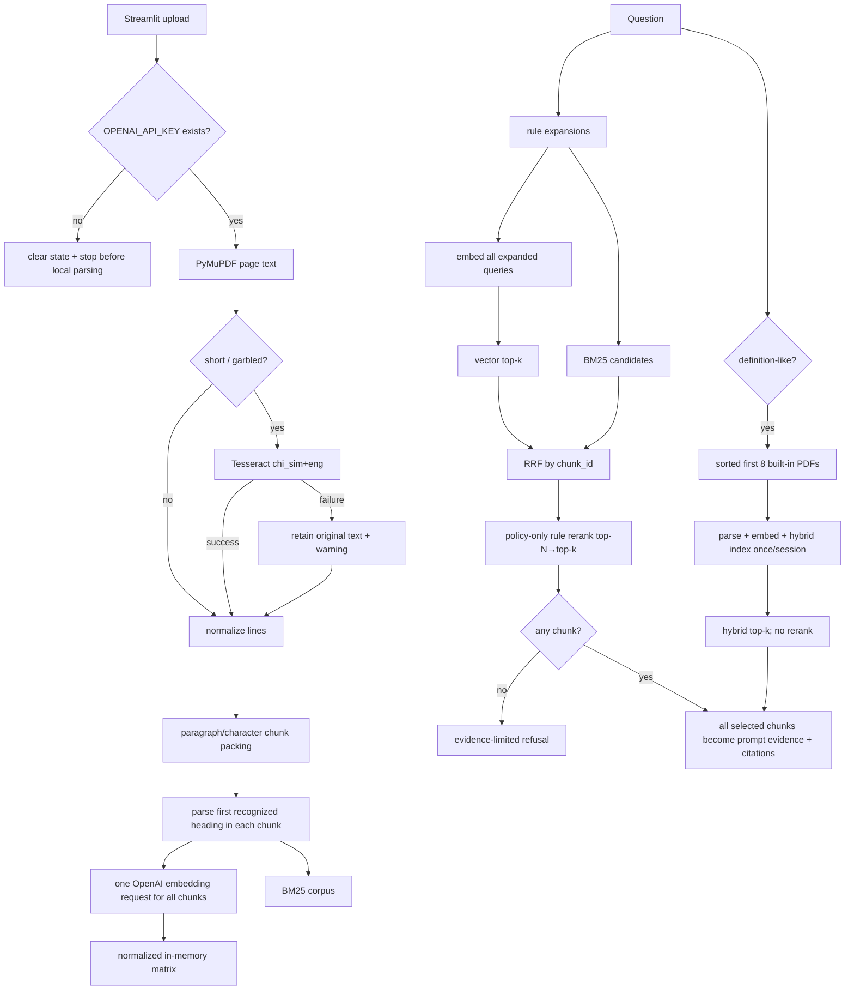

# InsuranceRAG 文档摄取、检索与重排成熟度评估

日期：2026-07-23

代码基准：`10355807314628c3fcc5ef11bb02d61a4792975a`

对应 Wayfinder ticket：[Assess document ingestion, chunking, retrieval, and reranking maturity](https://github.com/ShiriZhang/InsuranceRAG/issues/5)

## 1. 结论摘要

InsuranceRAG 的 retrieval side 已经超过“把 PDF 丢给向量库”的 demo：

- 有 page-level PDF extraction 和 nonfatal OCR fallback；
- 有条款编号/标题 metadata；
- 有带中文字符、bigram 和保险术语的 BM25；
- 有 vector + BM25 + multi-query RRF；
- 有 query rewrite、policy-only rule reranking 和 score/reason explanations；
- 有 policy/built-in source separation；
- 有 deterministic unit/component regression tests。

但它仍是 **L2 integrated prototype**，没有达到 **L3 measured and defensible retrieval system**。关键原因不是缺少更多 retrieval 算法，而是：

1. ingestion 与 retrieval 没有代表性、公开、带 gold relevance 的多页保险 PDF 基准；
2. chunking 不以条款边界为切分边界，同一 chunk 可包含多个条款却只保留首个标题；
3. evidence selection 没有 relevance/sufficiency threshold，任意 top-k vector result 都可被当作 policy evidence；
4. embedding API failure 会在 BM25 前终止，设计声称的 vector-to-BM25 degradation 不覆盖最常见的 service failure；
5. built-in background 只选择排序后的前 8 个 PDF，与问题内容无关；
6. reranker、query rewrite、parser 和 verifier 使用多套独立保险词表，缺少统一 vocabulary 与 corpus-level calibration；
7. embedding/index 没有 batching、retry、cache、versioned index metadata、latency/cost instrumentation 或 bounded-input policy。

当前最可信的 portfolio 表述是：

> InsuranceRAG implements an explainable deterministic retrieval pipeline with PDF parsing, clause metadata, BM25/vector RRF, query expansion, and rule reranking, backed by component regression tests. Retrieval quality against representative policies and live embeddings is not yet established.

不能表述为：

> The system has proven high retrieval accuracy or production-grade evidence selection.

本调查只建立 evidence、maturity judgment 和 improvement order；没有实现修复，也没有读取或输出本地私有保单内容。

## 2. 成熟度 rubric

| Level | 含义 |
| --- | --- |
| **L0 — absent** | 没有可执行能力 |
| **L1 — demo** | happy path 可运行，主要依赖人工检查或外部条件 |
| **L2 — integrated prototype** | 已接入主流程，有 deterministic component tests 和 fallback，但代表性质量、运维边界或 failure observability 不足 |
| **L3 — measured and defensible** | 有版本化 gold corpus、端到端指标、显式 evidence contract、可观测 fallback、可重复 live/offline comparison |
| **L4 — production hardened** | 在 L3 之上具备容量、成本、SLO、安全、持续监控、数据治理和发布回归门禁 |

## 3. 总体 maturity scorecard

| Capability | Level | 主要证据 | 阻止进入下一等级的缺口 |
| --- | --- | --- | --- |
| Text PDF ingestion | **L2** | PyMuPDF 内存解析、page metadata、错误转换、tests | 无复杂 layout/table/multi-column corpus；无 file/page/size bounds |
| OCR fallback | **L1** | 低文本/乱码触发、Tesseract failure nonfatal | 外部 runtime 未安装；无 confidence、版本、语言包 preflight 或真实扫描基准 |
| Clause structure extraction | **L2** | 多种条号/标题 regex、confidence/source、21 parser tests | 词典有限；不是 section tree；无 header/footer/layout model；metadata 只取 chunk 中首个 heading |
| Chunking | **L2** | paragraph packing、character overlap、page/source metadata | 不按 heading split；不跨页合并语义；无 section purity/context utilization metric |
| Embedding/index lifecycle | **L2** | OpenAI embedder、normalized in-memory index、session state | 全量单请求、无 batching/retry/cache、无 index/model fingerprint、无 input bounds |
| Rule query rewriting | **L2** | 保险 intent expansion、dedupe、fallback warning | hard-coded substring rules；LLM flag 是 placeholder；无 query-set effectiveness metrics |
| Hybrid retrieval | **L2** | BM25/CJK tokenization、vector、RRF、dedupe、16 focused tests | embedding outage 不降级；BM25 failures silent；无 relevance threshold、calibration 或 live comparison |
| Policy reranking | **L2** | bounded heuristic adjustment、reason codes、12 tests | 只 rerank policy；4-case hard-negative fixture；无 corpus-level MRR/nDCG/ablation |
| Built-in background selection | **L1** | source separation、definition gate、lazy session index | 固定前 8 个文件；无 query-aware corpus selection；失败后 session 不重试 |
| Evidence selection | **L1** | top-k policy results、无结果拒答、citations | “有任意 result”即“有 evidence”；无 sufficiency/coverage/diversity threshold |
| Retrieval observability | **L1–L2** | UI 显示 vector/BM25/RRF/rerank details | 无 structured run trace、fallback counters、latency/token/cost、index metadata |

总体：**L2 integrated prototype**。组件数量不是主要短板；measurement、evidence contract 和 failure semantics 才是。

## 4. 实际执行路径



## 5. 可执行基线

### 5.1 Focused regression suite

命令：

```powershell
python -m pytest -ra --durations=8 `
  tests\test_document_loader.py `
  tests\test_clause_parser.py `
  tests\test_chunker.py `
  tests\test_retriever.py `
  tests\test_query_rewriter.py `
  tests\test_hybrid_retriever.py `
  tests\test_rule_reranker.py `
  tests\test_builtin_dataset.py `
  tests\test_rag_chain.py `
  tests\test_evaluation.py
```

结果：

```text
Python 3.13.9
pytest 8.3.4
122 collected
122 passed
18.28s pytest duration
19.456s wall time
0 failed / 0 skipped / 0 xfailed
```

覆盖强项：

- parser pattern、directory-like line、fallback title；
- chunk metadata 与 continuation title；
- index dimension/empty-query validation；
- BM25 construction/search failure；
- vector-index `ValueError` fallback；
- query rewrite；
- rerank calibration bounds、subject/title/directory reasons；
- RAG retrieval/rerank fallback orchestration；
- synthetic/local CLI behavior。

覆盖边界：

- PDF test 是简单人工单页 text PDF；
- 没有真实 OCR；
- 没有 OpenAI network/model call；
- 没有 multi-column、table、header/footer、跨页条款或长保单 gold relevance；
- 没有 dedicated Streamlit upload/retrieval E2E；
- 没有 irrelevant-query abstention test；
- 没有 query embedding outage→BM25 fallback test；
- 没有 multi-heading-in-one-chunk section-purity test；
- built-in selector test只验证 count cap，不验证 relevance。

### 5.2 既有 baseline

同一代码下既有调查已记录：

- clean environment：222/222 tests passed；
- synthetic：2/2；
- synthetic hard-negative：4/4；
- safe single-chunk local PDF：regular 4/4、hard-negative 3/3；
- online OpenAI、real OCR 和 private corpus quality 未验证。

单 chunk local 满分是 pipeline execution evidence，不是 retrieval accuracy evidence。

## 6. 最小 failure probes

所有 probe 使用人工 `DocumentChunk` / `DocumentPage`，不读取真实保单。

### Probe A：零相似度结果仍被选为 evidence

构造两个向量均为 `[1, 0]` 的 chunks，以正交 query `[0, 1]` 搜索：

```text
H1 [('c2', 0.0), ('c1', 0.0)]
```

`InMemoryVectorIndex.search()` 只在 query norm 为零时返回空；对于合法但与所有 chunks 相似度为 0 的 query，仍返回 top-k。`RagChain` 随后只判断 `policy_chunks` 是否为空，没有 score/sufficiency gate。

影响：

- 完全无关问题仍可能进入 chat generation；
- 所有 top-k chunks 都成为 citations；
- answer guard 处理的是生成后的部分事实，不替代 retrieval evidence sufficiency。

需要测量：

- irrelevant-query abstention precision/recall；
- selected evidence minimum relevance；
- evidence coverage 与 unsupported-answer rate。

### Probe B：embedding outage 不会降级到 BM25

在有可用 BM25 corpus 的 `HybridRetriever` 中，让 query embedder 抛出：

```text
H2 RuntimeError synthetic embedding outage
```

根因：`embed_texts(expanded_queries)` 在 `HybridRetriever.search()` 的 vector/BM25 loop 之外执行。现有 fallback 只捕获 `vector_index.search()` 的 `ValueError`，不捕获 embedding API timeout/quota/network failure。

影响：

- 最常见的 vector service outage 会让 policy search 整体失败；
- `RagChain` 返回“保单检索失败”式 refusal，已经建好的 BM25 index 未被利用；
- “hybrid degrades to BM25”只能用于特定 local vector-index error，不能作为 service reliability claim。

需要测量：

- embedding failure rate/type；
- fallback mode counters；
- fallback retrieval quality；
- outage latency 和 user-visible result。

### Probe C：同 chunk 多条款只保留首标题

使用一个 55 字的人工页面，依次包含“第六条 等待期”“第七条 保险期间”“第八条 责任免除”，默认 `chunk_size=900`：

```text
H3 1 [('等待期', '第六条', 55)]
```

同一 chunk 的正文同时含三个条款，但 metadata 只有首个条款“等待期”。第二次独立运行得到相同结果。

根因：`_split_text()` 先按 size packing，`parse_clause_metadata()` 再对整个 packed chunk 返回第一个 heading。

影响：

- section title、clause id 和 heading confidence 不能代表整个 chunk；
- 责任免除 query 可能命中文本，却显示/重排为等待期；
- title-aware reranker 可能对包含正确 evidence 的 chunk施加错误 title penalty；
- citation title 和用户看到的 excerpt 语义边界不一致。

需要测量：

- section purity：每个 chunk 包含多少 distinct headings；
- heading-boundary split rate；
- wrong-title citation rate；
- heading-aware chunking 前后的 retrieval delta。

### Probe D：built-in 选择与 query 无关

给 selector 10 个按路径排序的人工 metadata：

```text
H4 ['00.pdf', '01.pdf', '02.pdf', '03.pdf', '04.pdf', '05.pdf', '06.pdf', '07.pdf']
```

`select_background_pdfs(docs, limit=8)` 没有 query 参数，只返回 `docs[:8]`。

影响：

- corpus 后 168 个本地 PDF 永远不会进入当前 session 的 background index；
- background relevance 取决于目录排序；
- 每次上传后的首次 definition query 要解析并 embedding 同一批文件；
- built-in background 的 recall、cost 和 latency 均不可解释。

需要测量：

- relevant-document recall@N；
- selected-document diversity；
- background indexing latency/token cost；
- built-in usage rate 和 source-confusion rate。

## 7. Ingestion maturity

### 已实现

- PDF 从 uploaded bytes 直接由 PyMuPDF 打开；
- page text、page number、extraction method 和 quality notes 保留；
- `min_page_text_chars` 和 replacement-character ratio 决定 OCR；
- OCR 用固定 2x raster 和 `chi_sim+eng`；
- OCR runtime/import/language failure不会终止整个 PDF；
- text lines 被规范化但保留换行，支持 heading detection；
- 加密、损坏或 unsupported PDF 被转换为用户可理解的错误。

### 可靠性缺口

1. **布局不可见**：`page.get_text("text")` 没有 multi-column order、table cell、reading-order 或 repeated header/footer correction。
2. **质量启发式过窄**：只有字符数和两个乱码字符；“长度足够但顺序错误”的页面不会触发 OCR/warning。
3. **OCR 无质量证据**：没有 confidence、language fallback、deskew、rotation、page image metrics 或 OCR text comparison。
4. **没有 bounded input contract**：无 upload size、page count、total text、chunk count、embedding input 或 processing-time limit。
5. **UI 本地解析与 OpenAI 强耦合**：`process_upload()` 在 parse 前要求 API key；用户不能先看到本地 parsing/quality result。
6. **失败恢复有限**：新 upload 首先清空旧 policy state；parse/index failure 后旧会话不可恢复，index build failure 也没有 retry action。
7. **隐私声明只覆盖 persistence**：代码不落盘是事实，但 extracted chunks 会发往 OpenAI；缺少 per-run data inventory/consent evidence。

### 可测 failure modes

| Failure mode | 当前检测 | 当前处理 | 缺少的 metric |
| --- | --- | --- | --- |
| corrupt/encrypted PDF | PyMuPDF exception | clear Chinese error | error category/rate |
| blank/scanned page | short-text heuristic | OCR；失败保留空/短文本 | OCR success、empty-page rate in UI |
| garbled extraction | replacement ratio | OCR | false-negative garble rate |
| wrong reading order | 无 | 当作正常 text | layout-order accuracy |
| table/multi-column loss | 无 | 当作正常 text | table/column extraction recall |
| oversized document | 无 explicit bound | memory/API dependent | pages、bytes、chunks、latency、cost |
| index build failure | exception | 保留 parse/chunks但不可问答 | retry success、failure reason |

## 8. Clause parsing 与 chunking maturity

### 已实现

- 支持中文/阿拉伯条号、decimal、parenthesized 和 numbered-list patterns；
- 已知保险标题使用 longest/earliest match；
- directory-like line 不作为 high-confidence heading；
- heading metadata 有 clause id、text、confidence、source；
- low-confidence continuation 继承上一 chunk title；
- paragraph packing 和 character overlap 有参数校验。

### 技术债

- parser 的 `KNOWN_SECTION_TITLES` 是 closed vocabulary；
- chunker、parser、retriever、rewriter、reranker、guard/verifier 各自维护词表；
- chunk boundary 不以 heading 为 first-class boundary；
- chunk 永不跨 page 组合，即使条款在 page break 被切断；
- overlap 只用于超长单 paragraph；普通 paragraph packing 超限后没有跨 chunk overlap；
- carried-forward title 可能跨 page 继续传播错误 metadata；
- `heading_confidence_warn_threshold` 没有 runtime consumer；
- UI 不显示 high/medium/low heading distribution 或 section-purity warning；
- 旧 `infer_section_title()` 仍由 direct tests 保留，形成重复 heading logic。

### 判断

条款 metadata 对 explainability 和 reranking 有真实价值，但它目前是 **chunk annotation**，不是 **policy structure model**。portfolio 中应避免称其为完整 structured policy parsing。

## 9. Embedding 与 index lifecycle maturity

### 已实现

- upload 时一次性为 policy chunks 生成 embeddings；
- matrix row normalization 和 query dimension validation；
- index/retriever/embedder 存在 Streamlit session state；
- reupload 清空旧 index；
- built-in index按需 lazy build；
- vector-only/hybrid config 可切换。

### 技术债

- `OpenAIEmbedder.embed_texts()` 把全部 texts 放在一个 API request；
- 没有 batching、retry/backoff、timeout policy、rate-limit handling 或 partial result handling；
- 没有 content hash/cache，重复 upload 和 app restart 会重复付费；
- 没有 model/version/dimension/index fingerprint；
- 没有 token estimate、input truncation 或 max batch size；
- 没有 index build/query latency、API calls、tokens 或 cost；
- built-in index与每个 policy session绑定，且失败后 `builtin_index_attempted=True` 阻止 retry；
- lower-bound dependencies 与 model aliases 使跨时间结果不固定。

### 判断

这是一套清晰的 ephemeral index lifecycle，但不是 operationally mature embedding subsystem。

## 10. Query rewrite、hybrid retrieval 与 reranking maturity

### Query rewrite

优点：

- original question 保留；
- common insurance intents 有明确 expansions；
- dedupe deterministic；
- 空 query 和 placeholder LLM mode 有 warning。

缺口：

- substring trigger 容易漏掉未编码表达，也可能让一个问题触发多个宽泛 intents；
- expanded queries 没有权重，原问题与每个 expansion 对 RRF 贡献相同；
- `query_rewrite_llm=true` 不执行 LLM，只显示 fallback warning；
- 没有 per-rule recall gain、precision loss 或 query drift metric。

### Hybrid retrieval

优点：

- CJK char/bigram、ASCII 和 insurance term tokens；
- exact term 与 semantic signal组合；
- RRF 避免直接归一化不同 score；
- 跨 expansions 用 chunk id dedupe；
- BM25 failure 可退回 vector，特定 vector `ValueError` 可保留 BM25；
- score/rank details 可解释。

缺口：

- query embedding API failure 阻止 BM25；
- BM25 construction/search exception被静默吞掉；
- embedder 返回较少 vectors 时静默只对剩余 query使用 BM25；
- `retrieval_mode` 没有显式 allowed-value validation；
- RRF score随 expansions 数量/重复 signal积累，未在真实 corpus calibration；
- 没有 candidate score threshold、document/section diversity 或 adjacent-chunk merge；
- dedupe 只按 `chunk_id`，不处理高度重叠 chunks。

### Rule reranking

优点：

- policy candidates 先取 top-N，再缩到 top-k；
- title intent、negative title、fact type、subject、number、heading confidence 和 directory patterns有 reason codes；
- adjustment有 bounds，tests 防止轻微 rule hit压过强 hybrid gap；
- failure退回原顺序并 warning。

缺口：

- weights由 hand tuning 固定，没有公开 corpus calibration；
- 多套 intent/title dictionaries 可漂移；
- numeric match只判断相同字符串，不理解单位、中文数字规范化或 fact relationship；
- directory penalty可越过一般 bounded adjustment，是单独 hard-coded score；
- built-in results不 rerank；
- hard-negative fixture 只有 4 cases，无法估计误升/误降率；
- 无 vector-only vs hybrid vs reranked ablation。

## 11. Evidence selection 与 built-in separation

Source separation 的 policy boundary 是正确的：

- policy results 为空时不调用 chat；
- built-in 只在已有 policy result、且问题像 definition 时进入 prompt；
- prompt 和 citations 分组；
- built-in retrieval failure降级到 policy-only。

但“有 policy result”不等于“有足够 evidence”：

- vector top-k没有 minimum similarity；
- hybrid/RRF没有 calibrated acceptance threshold；
- reranker只排序，不做 relevance rejection；
- 没有确保 selected chunks覆盖问题中的多个 subclaims；
- 没有 context budget、MMR/diversity、section coverage 或 adjacent-chunk consolidation；
- citations 是所有 selected chunks，不是 evidence selector 的独立输出。

因此当前系统实现了 **source separation**，但没有成熟的 **evidence sufficiency contract**。

Built-in background 还存在三个额外问题：

1. corpus selection 固定为前 8 个文件；
2. build gate只看 definition keywords，不做 question-to-document routing；
3. built-in index构建与当前 policy session耦合，成本与失败不可复用。

## 12. 风险优先级

| Priority | 风险 | Why now | 可观察结果 |
| --- | --- | --- | --- |
| **P0** | 无 evidence sufficiency/abstention gate | 直接影响 unsupported answer 和 citation可信度 | irrelevant query仍产生 policy chunks |
| **P0** | 没有 representative gold retrieval corpus | 无法证明任何 algorithm change 是 improvement | 只有2+4 synthetic cases和退化 single-chunk local probe |
| **P1** | 多 heading 被压入单 chunk | 破坏 metadata、rerank和citation title | probe稳定得到三条款/一个“等待期”chunk |
| **P1** | embedding outage不能BM25 fallback | 与已有 reliability claim冲突 | synthetic outage直接 RuntimeError |
| **P1** | built-in固定前8 | recall、cost、source risk不可控 | selector与query无关 |
| **P1** | silent retrieval degradation | 用户和评测不知道实际运行模式 | BM25 errors无 warning |
| **P2** | embedding lifecycle无 bounds/cache/metrics | 长文档成本和失败不可预测 | 无 run metadata |
| **P2** | duplicated insurance vocabulary | 新术语需多处同步，容易漂移 | 至少7个独立词表 |
| **P2** | OCR/layout未测 | 扫描保单是核心真实输入风险 | 无 real OCR/layout corpus |
| **P3** | compatibility/dead surfaces | 增加维护认知负担 | `infer_section_title`、`RerankExplanation` |

## 13. 最小可信改进顺序

这些是后续 milestone 的候选输入，不在本 ticket 实现。

### 1. 先建立 safe retrieval contract 和 gold fixture

最小范围：

- 3–5 个 repo-contained 人工多页 PDF；
- 至少覆盖多 heading、跨页条款、目录、相似条款、number/subject confusion；
- 每个 query 标注 relevant document/chunk/section 和应 abstain 的 negative queries；
- 报告 vector、BM25、hybrid、reranked 的 Recall@k、MRR、nDCG 或至少 raw rank counts；
- 固定 parser/chunker config 与 resolved model metadata。

理由：没有这个 feedback loop，调整 chunk size、weights、threshold 或算法都只是不可证伪的 tuning。

### 2. 让 heading 成为 chunk boundary

最小范围：

- 在 paragraph packing 前识别 heading；
- 新 heading 强制关闭前一 chunk；
- 明确跨页 continuation；
- 增加 section-purity 和 multi-heading regression tests。

理由：这同时改善 citation title、rerank features、local evaluation 和用户可解释性，是小而深的 module improvement。

### 3. 建立显式 retrieval outcome 与可观测 fallback

最小范围：

- `HybridRetriever` 返回 results + warnings/effective modes；
- query embedding失败时，在已有 BM25 index 上继续；
- BM25 failure不再 silent；
- 记录 vector/BM25/rerank candidates、latency 和 failure category。

理由：先让系统知道自己运行了什么，才能可信评估 reliability。

### 4. 添加 evidence sufficiency/selection gate

最小范围：

- 在 retrieval 与 generation 之间新增明确 selection seam；
- 支持 irrelevant-query abstention；
- 使用 benchmark calibration threshold，而不是拍脑袋 score；
- 去重高度重叠 chunks，限制 per-section candidates，并输出 selection reasons；
- separate “retrieved candidate” from “selected evidence”。

理由：这是 source-grounded QA 的核心 contract，比增加 agent persona 或额外 LLM call 更有 portfolio 价值。

### 5. 重做 built-in background routing

最小范围：

- 不再固定前 8；
- 先用本地 metadata/BM25 做 query-aware document selection；
- built-in index独立于 policy session缓存并带 fingerprint；
- 测量 background recall、latency/cost 和 source-confusion。

理由：当前 background path 是功能存在但证据最弱的 retrieval branch。

### 6. 再处理 OCR/layout 与 embedding operations

- 固定 Tesseract/version/language preflight；
- 加入人工扫描、rotation、multi-column/table fixtures；
- embedding batching、retry、bounds、cache、model/index fingerprint；
- run-level token/cost/latency metadata。

理由：这些是从 L3 走向 L4 的必要条件，但应建立 gold fixture 和 evidence contract 后再优化。

## 14. Portfolio 与 agentic judgment

当前 retrieval pipeline 展示了不错的 Agentic AI Developer 基础能力：

- modular tool-like components；
- deterministic orchestration；
- structured metadata 和 explanations；
- graceful local fallbacks；
- regression tests；
- source-role separation。

但它不是 agentic workflow：

- 没有根据 evidence quality选择下一步；
- 没有 retrieve→assess→retry/rewrite/tool-switch loop；
- 没有 explicit run state、budget 或 stop condition；
- 没有 trace-based evaluation。

未来若增加 agentic behavior，可信方向应是：

```text
retrieve
→ assess evidence sufficiency
→ choose: accept / query rewrite / lexical fallback / ask clarification / abstain
→ record decision and evidence trace
```

不可信方向是增加多个命名 agent/persona，而 evidence contract、metrics 和 failure recovery 仍缺失。

## 15. 后续 Wayfinder 输入

- generation/citation/safety 调查必须区分：
  - retrieved candidate；
  - selected evidence；
  - displayed citation；
  - verified fact。
- evaluation/observability 调查应把 retrieval mode、fallback、model/index fingerprint、latency/cost 和 selection trace纳入 run artifact。
- glossary/ADR 应明确：
  - user policy evidence；
  - built-in background；
  - retrieval candidate；
  - selected evidence；
  - abstention；
  - clause boundary。
- milestone 决策不应优先选择新 model、agent framework 或 LLM reranker；应先选择能让 retrieval improvement 可测、可解释、可回归的 deep seam。

## 16. 可复核命令

```powershell
# focused regression
python -m pytest -ra --durations=8 `
  tests\test_document_loader.py `
  tests\test_clause_parser.py `
  tests\test_chunker.py `
  tests\test_retriever.py `
  tests\test_query_rewriter.py `
  tests\test_hybrid_retriever.py `
  tests\test_rule_reranker.py `
  tests\test_builtin_dataset.py `
  tests\test_rag_chain.py `
  tests\test_evaluation.py

# execution paths and silent degradation
rg -n "embed_texts|_add_vector_results|_add_bm25_results|except" `
  src\insurance_rag\retriever.py `
  src\insurance_rag\hybrid_retriever.py

# heading/chunk order
rg -n "_split_text|parse_clause_metadata|current_title" `
  src\insurance_rag\chunker.py `
  src\insurance_rag\clause_parser.py

# built-in selection and lifecycle
rg -n "select_background_pdfs|limit=8|builtin_index_attempted" `
  app.py src\insurance_rag\builtin_dataset.py

# evidence sufficiency
rg -n "policy_chunks|final_score|REFUSAL_ANSWER" `
  src\insurance_rag\rag_chain.py `
  src\insurance_rag\retriever.py
```
